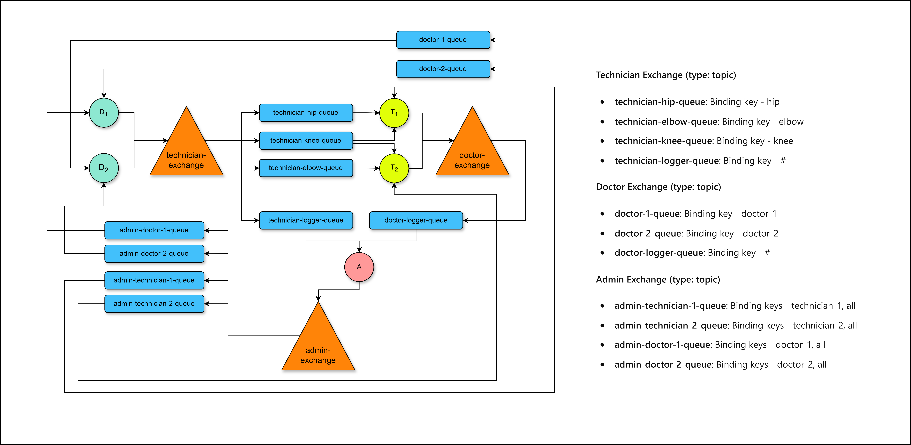

Install dependencies:
```bash
npm install
```

Run RabbitMQ server in Docker:
```bash
docker run -d --hostname rabbit --name rabbit-server-ds -p 15672:15672 -p 5672:5672 rabbitmq:3.12.2-management
```

Check out package.json for scripts to run the project.


